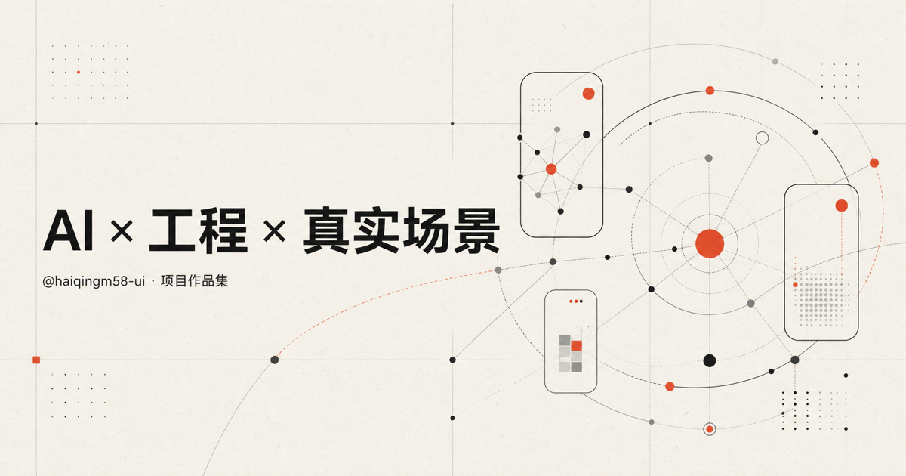

# 个人作品集



一个以「设计 × 技术 × 产品思维」为核心的中文个人作品集网站，展示代表项目、个人介绍、专业能力与联系方式。

## 在线访问

[打开作品集](https://haiqingm58-ui.github.io/personal-portfolio/)

## 页面内容

- 定位清晰的个人首页
- 三个代表项目案例
- 个人介绍与工作原则
- 产品策略、体验设计、设计系统与原型实现能力
- 响应式移动端布局
- Open Graph 社交分享封面

## 本地运行

```bash
npm install
npm run dev
```

然后访问 `http://localhost:3000`。

## 构建

```bash
npm run build
```

> 当前姓名、项目详情与邮箱为示例内容，发布正式版本前请替换为真实资料。
